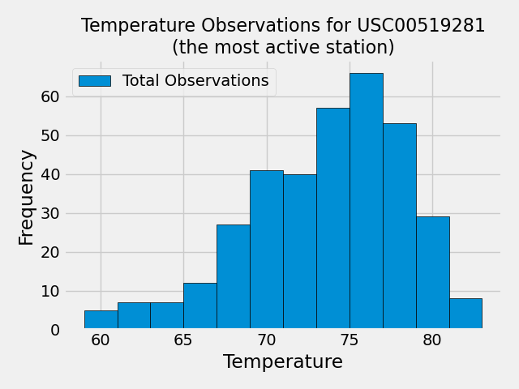

## 10-sqlalchemy-challenge, 24 August 2023, SQLAlchemy

Development on this project has stopped.

## Description

This project simulates vacation planning by analyzing climate data for Honolulu, Hawaii, especially temperature and precipitation, using SQLAlchemy to map objects from a sqlite database so they can be queried in python.

After the analysis, Flask is used to create a climate API to return JSON's for the last year of precipitation, a list of weather stations, and temperature observations for the prior year for the most-active station. It allows a user to submit a start or start-end date and return a JSON of minimum, average, and maximum temperature for a specific start date or start and end range.

## Usage

You can view the climate analysis results in 'climate.ipynb', located in the repository root. If you want to run the code, restart the kernel and 'run all'.

'app.py' creates a climate api and returns JSON queries to users.  Run 'app.py' and open the developer website that it creates to view JSONs. The precipitation, weather stations, and temperature observations are hyperlinked. The start and start-end ones must be manually created, substituting in the date(s) in the appropriate format.

## Gallery of Significant Results:

Exploratory Precipitation Analysis:

Exploratory Analysis of Total Number of Temperature Observations:

## Acknowledgments

Thanks to Geronimo Perez for feedback and assistance

## Author

Bryan Johns, August, 2023
